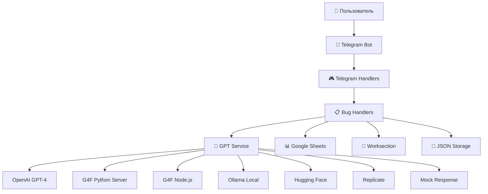
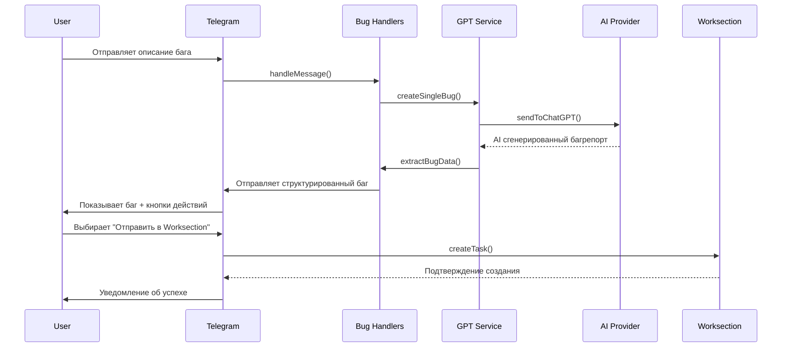
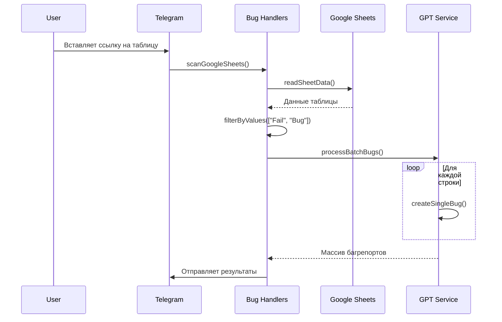

# 📚 LTO 2.0 Bug Report Bot - Техническая документация

> **Подробное описание архитектуры, компонентов и принципов работы системы автоматизации багрепортов**

## 📋 Содержание

1. [Обзор системы](#обзор-системы)
2. [Архитектура](#архитектура)
3. [Компоненты](#компоненты)
4. [Потоки данных](#потоки-данных)
5. [AI провайдеры](#ai-провайдеры)
6. [API интеграции](#api-интеграции)
7. [Структура файлов](#структура-файлов)
8. [Конфигурация](#конфигурация)
9. [Безопасность](#безопасность)
10. [Мониторинг и логирование](#мониторинг-и-логирование)

---

## 🔍 Обзор системы

### Назначение

LTO 2.0 Bug Report Bot - это многоуровневая система автоматизации создания багрепортов, специально настроенная для лазертаг приложения LTO 2.0. Система преобразует неструктурированные описания проблем в детальные, структурированные багрепорты с использованием современных технологий обработки текста.

### Ключевые принципы

- **Отказоустойчивость**: 7-уровневая система fallback для AI провайдеров
- **Контекстность**: Специализированные промпты для лазертаг домена
- **Гибкость**: Поддержка множественных источников данных
- **Масштабируемость**: Модульная архитектура для легкого расширения

---

## 🏗️ Архитектура

### Высокоуровневая схема



### Многоуровневая архитектура

```
┌─────────────────────────────────────────────┐
│ 📱 Presentation Layer (Telegram UI)        │
├─────────────────────────────────────────────┤
│ 🎮 Interface Layer (Handlers)              │
├─────────────────────────────────────────────┤
│ 📋 Business Logic Layer (Bug Handlers)     │
├─────────────────────────────────────────────┤
│ 🧠 AI Processing Layer (GPT Service)       │
├─────────────────────────────────────────────┤
│ 🔄 Provider Chain Layer (Multi-AI)         │
├─────────────────────────────────────────────┤
│ 🌐 Integration Layer (APIs)                │
├─────────────────────────────────────────────┤
│ 💾 Data Layer (Storage)                    │
└─────────────────────────────────────────────┘
```

---

## 🧩 Компоненты

### 1. 📱 Telegram Bot Core (`bot.js`)

**Назначение**: Точка входа, инициализация всех сервисов

```javascript
// Основные обязанности:
- Подключение к Telegram Bot API
- Регистрация обработчиков команд
- Инициализация сервисов
- Глобальная обработка ошибок
```

**Ключевые функции**:

- `initializeBot()` - Инициализация бота
- `setupCommands()` - Регистрация команд
- `gracefulShutdown()` - Корректное завершение

### 2. 🎮 Telegram Handlers (`src/handlers/telegramHandlers.js`)

**Назначение**: Обработка Telegram событий и состояний пользователей

```javascript
// Управляемые состояния:
- waiting_bug_description: Ожидание описания бага
- selecting_project: Выбор проекта
- setting_credentials: Настройка учетных данных
- scanning_sheets: Сканирование Google Sheets
- processing_checklist: Обработка чек-листа
```

**Основные функции**:

- `handleMessage()` - Обработка текстовых сообщений
- `handleCallbackQuery()` - Обработка inline кнопок
- `handleCommand()` - Обработка команд бота
- `manageUserState()` - Управление состоянием пользователя

### 3. 📋 Bug Handlers (`src/handlers/bugHandlers.js`)

**Назначение**: Основная бизнес-логика создания багрепортов

```javascript
// Основные потоки:
1. Single Bug Creation - Создание одиночного бага
2. Batch Processing - Массовая обработка
3. Google Sheets Integration - Интеграция с таблицами
4. Checklist Processing - Обработка чек-листов
```

**Ключевые функции**:

- `createSingleBug()` - Создание одного бага
- `processBatchBugs()` - Массовая обработка
- `scanGoogleSheets()` - Сканирование таблиц
- `validateBugData()` - Валидация данных

### 4. 🧠 GPT Service (`src/services/gptService.js`)

**Назначение**: Центральный сервис для работы с AI провайдерами

#### Алгоритм выбора провайдера:

```javascript
async sendToChatGPT(prompt) {
  try {
    // 1. OpenAI GPT-4 (если настроен ключ)
    if (hasOpenAIKey) return await sendToOpenAI(prompt);

    // 2. G4F Python Server (стабильный бесплатный)
    try { return await sendToG4FPython(prompt); }
    catch { console.log("G4F Python недоступен"); }

    // 3. G4F Node.js (резервный бесплатный)
    try { return await sendToG4F(prompt); }
    catch { console.log("G4F Node.js недоступен"); }

    // 4. Ollama Local (локальные модели)
    try { return await sendToOllama(prompt); }
    catch { console.log("Ollama недоступен"); }

    // 5. Hugging Face (открытые модели)
    try { return await sendToHuggingFace(prompt); }
    catch { console.log("Hugging Face недоступен"); }

    // 6. Replicate (облачные Llama)
    try { return await sendToReplicate(prompt); }
    catch { console.log("Replicate недоступен"); }

    // 7. Mock Response (гарантированный ответ)
    return await sendMockResponse(prompt);
  }
}
```

**Функции парсинга**:

- `extractBugData()` - Извлечение данных из AI ответа
- Поддержка форматов: `**Bold**`, `#### Markdown`
- Автоматическое дополнение недостающих полей

### 5. 🌐 G4F Python Server (`g4f_server.py`)

**Назначение**: Отдельный Flask сервер для стабильной работы с G4F

```python
# Архитектура:
Flask App (port 5000)
├── /health - Проверка статуса
├── /chat - Генерация ответов
├── /providers - Список провайдеров

# Поддерживаемые провайдеры:
PROVIDERS = [
    g4f.Provider.Bing,        # Microsoft Bing Chat
    g4f.Provider.You,         # You.com
    g4f.Provider.ChatgptFree, # Бесплатный ChatGPT
    g4f.Provider.FreeGpt,     # FreeGPT
    g4f.Provider.OpenaiChat,  # OpenAI Chat
    g4f.Provider.ChatgptAi,   # ChatGPT AI
    g4f.Provider.Aichat,      # AI Chat
    g4f.Provider.ChatForAi,   # Chat for AI
]
```

**Алгоритм работы**:

1. Получение POST запроса на `/chat`
2. Перебор провайдеров до успешного ответа
3. Возврат JSON с ответом и информацией о провайдере

### 6. 💾 Storage Services

#### User Storage (`src/services/userStorage.js`)

```javascript
// Структура данных пользователя:
{
  userId: "12345",
  state: "waiting_bug_description",
  worksectionCredentials: {
    email: "user@example.com",
    password: "encrypted_password"
  },
  selectedProject: {
    id: "project_123",
    name: "LTO 2.0",
    url: "https://worksection.com/project/123"
  },
  settings: {
    autoSend: false,
    preferredProvider: "openai"
  }
}
```

#### Project Manager (`src/services/projectManager.js`)

```javascript
// Функции управления проектами:
- loadUserProjects() - Загрузка проектов пользователя
- addProject() - Добавление нового проекта
- selectProject() - Выбор активного проекта
- validateProject() - Валидация проекта
```

### 7. 🔌 API Integrations

#### Google Sheets API (`src/api/sheets.js`)

```javascript
// Основные функции:
- readSheetData() - Чтение данных из таблицы
- parseSheetURL() - Парсинг URL таблицы
- extractColumn() - Извлечение данных столбца
- filterByValues() - Фильтрация по значениям
```

#### Worksection Service (`src/services/worksectionService.js`)

```javascript
// Автоматизация Worksection:
- login() - Авторизация в системе
- createTask() - Создание задачи
- uploadBugReport() - Загрузка багрепорта
- validateCredentials() - Проверка учетных данных
```

---

## 🔄 Потоки данных

### 1. Создание одиночного бага



### 2. Сканирование Google Sheets



---

## 🤖 AI провайдеры

### Конфигурация провайдеров

| Провайдер     | Тип         | Стоимость | Качество   | Скорость   | Надежность |
| ------------- | ----------- | --------- | ---------- | ---------- | ---------- |
| OpenAI GPT-4  | Платный API | $$        | ⭐⭐⭐⭐⭐ | ⭐⭐⭐⭐   | ⭐⭐⭐⭐⭐ |
| G4F Python    | Бесплатный  | Free      | ⭐⭐⭐⭐   | ⭐⭐⭐     | ⭐⭐⭐⭐   |
| G4F Node.js   | Бесплатный  | Free      | ⭐⭐⭐     | ⭐⭐       | ⭐⭐       |
| Ollama Local  | Локальный   | Free      | ⭐⭐⭐     | ⭐⭐⭐⭐⭐ | ⭐⭐⭐⭐⭐ |
| Hugging Face  | Бесплатный  | Free      | ⭐⭐       | ⭐⭐       | ⭐⭐⭐     |
| Replicate     | Платный API | $         | ⭐⭐⭐     | ⭐⭐⭐     | ⭐⭐⭐⭐   |
| Mock Response | Локальный   | Free      | ⭐         | ⭐⭐⭐⭐⭐ | ⭐⭐⭐⭐⭐ |

### Специализированные промпты

#### BASE_PROMPT (для OpenAI, G4F)

```javascript
const BASE_PROMPT = `
КОНТЕКСТ ПРОЕКТА: 
Ты создаешь баг-листы для приложения "LTO 2.0" - это мобильное Android приложение для лазертаг боев...

Основные функции приложения:
- Управление игровыми режимами и сценариями
- Настройка параметров оружия (урон, дальность, боекомплект)
- Управление защитой игроков (бронежилеты, щиты)
...
`;
```

#### LLAMA_PROMPT (для локальных моделей)

```javascript
const LLAMA_PROMPT = `
ВАЖНО: Создай ПОЛНЫЙ детальный багрепорт на русском языке с учетом специфики лазертаг приложения...

ОБЯЗАТЕЛЬНЫЙ формат ответа (заполни ВСЕ поля подробно):
**Название:** [Краткое но точное название бага связанного с лазертагом]
**Описание:** [Подробное описание проблемы в контексте лазертаг игры]
...
`;
```

---

## 🌐 API интеграции

### Telegram Bot API

```javascript
// Используемые методы:
- sendMessage() - Отправка сообщений
- editMessageText() - Редактирование сообщений
- answerCallbackQuery() - Ответы на callback
- sendDocument() - Отправка файлов

// Inline клавиатуры:
- Главное меню (создать баг, сканировать таблицу)
- Действия с багом (копировать, отправить в WS)
- Выбор проекта
- Настройки
```

### Google Sheets API

```javascript
// Endpoints:
GET /v4/spreadsheets/{spreadsheetId}/values/{range}

// Параметры:
- key: API ключ
- range: Диапазон ячеек (A1:Z1000)
- valueRenderOption: FORMATTED_VALUE
```

### Worksection API

```javascript
// Автоматизация через Puppeteer:
1. Открытие браузера
2. Переход на страницу логина
3. Ввод учетных данных
4. Навигация к проекту
5. Создание новой задачи
6. Заполнение формы
7. Сохранение задачи
```

---

## 📁 Структура файлов

### Детальная структура

```
google-sheets-project/
├── 📄 bot.js                           # Точка входа приложения
├── 📄 package.json                     # NPM зависимости и скрипты
├── 📄 .env                            # Переменные окружения
├── 📄 .gitignore                      # Игнорируемые файлы
│
├── 📄 g4f_server.py                   # Python сервер для G4F
├── 📄 g4f_requirements.txt            # Python зависимости
├── 📄 start_g4f_server.bat           # Скрипт запуска G4F сервера
│
├── 📁 src/                            # Исходный код
│   ├── 📁 api/                        # Внешние API
│   │   └── 📄 sheets.js              # Google Sheets интеграция
│   │
│   ├── 📁 config/                     # Конфигурация
│   │   ├── 📄 config.js              # Основные настройки
│   │   └── 📄 prompt.js              # AI промпты
│   │
│   ├── 📁 handlers/                   # Обработчики событий
│   │   ├── 📄 bugHandlers.js         # Бизнес-логика багов
│   │   └── 📄 telegramHandlers.js    # Telegram события
│   │
│   ├── 📁 services/                   # Сервисы и утилиты
│   │   ├── 📄 gptService.js          # AI провайдеры
│   │   ├── 📄 userStorage.js         # Управление пользователями
│   │   ├── 📄 projectManager.js      # Управление проектами
│   │   ├── 📄 validation.js          # Валидация данных
│   │   └── 📄 worksectionService.js  # Worksection автоматизация
│   │
│   ├── 📁 keyboards/                  # Telegram UI
│   │   └── 📄 inlineKeyboards.js     # Inline клавиатуры
│   │
│   └── 📁 components/                 # Переиспользуемые компоненты
│       ├── 📄 domUtils.js            # DOM утилиты
│       ├── 📄 domUtils.js            # Дубликат (legacy)
│       └── 📄 loading.js             # Индикаторы загрузки
│
├── 📁 storage/                        # Локальное хранилище
│   └── 📄 users.json                 # Данные пользователей
│
├── 📁 automation/                     # Скрипты автоматизации
│   ├── 📄 login-worksection.js       # Логин в Worksection
│   └── 📄 worksection-task.js        # Создание задач
│
└── 📁 legacy/                         # Устаревшие файлы
    ├── 📄 command.txt                # Старые команды
    ├── 📄 icon.png                   # Иконка проекта
    ├── 📄 install.bat                # Установочный скрипт
    ├── 📄 manifest.json              # Манифест расширения
    ├── 📄 requirements.txt           # Python зависимости (старые)
    ├── 📄 server.py                  # Старый Python сервер
    ├── 📄 start_server.bat           # Старый скрипт запуска
    └── 📄 start_server.vbs           # VBS скрипт запуска
```

---

## ⚙️ Конфигурация

### Переменные окружения (.env)

```env
# Обязательные
TELEGRAM_BOT_TOKEN=1234567890:ABCDEF...    # Токен Telegram бота

# AI провайдеры (опционально)
OPENAI_API_KEY=sk-...                      # OpenAI API ключ
HUGGINGFACE_TOKEN=hf_...                   # Hugging Face токен
REPLICATE_API_TOKEN=r8_...                 # Replicate API токен

# Интеграции (опционально)
GOOGLE_SHEETS_API_KEY=AIza...              # Google Sheets API ключ
WORKSECTION_EMAIL=user@example.com         # Email для Worksection
WORKSECTION_PASSWORD=password123           # Пароль для Worksection

# Настройки сервера
G4F_SERVER_URL=http://127.0.0.1:5000      # URL G4F Python сервера
OLLAMA_URL=http://localhost:11434          # URL Ollama сервера
```

### Конфигурация AI провайдеров

```javascript
// OpenAI настройки
const OPENAI_CONFIG = {
  model: "gpt-4",
  temperature: 0.7,
  max_tokens: 2000,
  timeout: 60000,
};

// Ollama настройки
const OLLAMA_CONFIG = {
  models: ["llama3:8b", "llama3.2:1b"],
  num_predict: 1000,
  temperature: 0.4,
  timeout: 120000,
};

// G4F настройки
const G4F_CONFIG = {
  timeout: 120000,
  providers: ["Bing", "You", "ChatgptFree"],
  retries: 3,
};
```

---

## 🔒 Безопасность

### Обработка чувствительных данных

```javascript
// Шифрование паролей
const crypto = require("crypto");

function encryptPassword(password) {
  const algorithm = "aes-256-cbc";
  const key = process.env.ENCRYPTION_KEY;
  const iv = crypto.randomBytes(16);

  const cipher = crypto.createCipher(algorithm, key);
  let encrypted = cipher.update(password, "utf8", "hex");
  encrypted += cipher.final("hex");

  return {
    iv: iv.toString("hex"),
    encryptedData: encrypted,
  };
}
```

### Валидация входных данных

```javascript
// Валидация URLs
function validateSheetURL(url) {
  const pattern =
    /^https:\/\/docs\.google\.com\/spreadsheets\/d\/[a-zA-Z0-9-_]+/;
  return pattern.test(url);
}

// Санитизация текста
function sanitizeInput(text) {
  return text
    .replace(/<script\b[^<]*(?:(?!<\/script>)<[^<]*)*<\/script>/gi, "")
    .replace(/[<>]/g, "")
    .trim();
}
```

### Ограничения доступа

```javascript
// Проверка прав пользователя
function checkUserPermissions(userId) {
  const adminUsers = process.env.ADMIN_USERS?.split(",") || [];
  return adminUsers.includes(userId.toString());
}

// Ограничения по частоте запросов
const rateLimit = new Map();

function checkRateLimit(userId) {
  const now = Date.now();
  const userRequests = rateLimit.get(userId) || [];

  // Очищаем старые запросы (старше 1 минуты)
  const recentRequests = userRequests.filter((time) => now - time < 60000);

  if (recentRequests.length >= 10) {
    return false; // Превышен лимит
  }

  recentRequests.push(now);
  rateLimit.set(userId, recentRequests);
  return true;
}
```

---

## 📊 Мониторинг и логирование

### Система логирования

```javascript
// Уровни логирования
const LOG_LEVELS = {
  ERROR: 0,
  WARN: 1,
  INFO: 2,
  DEBUG: 3,
};

// Структурированные логи
function log(level, message, metadata = {}) {
  const timestamp = new Date().toISOString();
  const logEntry = {
    timestamp,
    level,
    message,
    ...metadata,
  };

  console.log(JSON.stringify(logEntry));

  // Отправка критических ошибок в Telegram
  if (level === "ERROR") {
    notifyAdmin(message, metadata);
  }
}
```

### Метрики производительности

```javascript
// Измерение времени выполнения AI запросов
class PerformanceTracker {
  static timers = new Map();

  static start(operationId) {
    this.timers.set(operationId, Date.now());
  }

  static end(operationId, provider) {
    const startTime = this.timers.get(operationId);
    if (startTime) {
      const duration = Date.now() - startTime;
      log("INFO", "AI Request Performance", {
        provider,
        duration,
        operationId,
      });
      this.timers.delete(operationId);
    }
  }
}
```

### Статистика использования

```javascript
// Сбор статистики
const stats = {
  totalBugsCreated: 0,
  providerUsage: {},
  userActivity: {},
  errors: [],
};

function trackBugCreation(provider) {
  stats.totalBugsCreated++;
  stats.providerUsage[provider] = (stats.providerUsage[provider] || 0) + 1;
}

function trackUserActivity(userId, action) {
  if (!stats.userActivity[userId]) {
    stats.userActivity[userId] = {};
  }
  stats.userActivity[userId][action] =
    (stats.userActivity[userId][action] || 0) + 1;
}
```

---

## 🚀 Развертывание и масштабирование

### Docker конфигурация (планируется)

```dockerfile
# Dockerfile
FROM node:18-alpine

WORKDIR /app

# Установка Node.js зависимостей
COPY package*.json ./
RUN npm ci --only=production

# Установка Python для G4F сервера
RUN apk add --no-cache python3 py3-pip
COPY g4f_requirements.txt ./
RUN pip3 install -r g4f_requirements.txt

# Копирование исходного кода
COPY . .

# Запуск сервисов
EXPOSE 3000 5000
CMD ["sh", "-c", "python3 g4f_server.py & npm start"]
```

### Docker Compose

```yaml
version: "3.8"
services:
  bot:
    build: .
    environment:
      - TELEGRAM_BOT_TOKEN=${TELEGRAM_BOT_TOKEN}
      - OPENAI_API_KEY=${OPENAI_API_KEY}
    volumes:
      - ./storage:/app/storage
    ports:
      - "3000:3000"
      - "5000:5000"
    restart: unless-stopped

  ollama:
    image: ollama/ollama
    ports:
      - "11434:11434"
    volumes:
      - ollama_data:/root/.ollama
    restart: unless-stopped

volumes:
  ollama_data:
```

---

> 📝 **Примечание**: Данная документация является живым документом и обновляется по мере развития системы. Последнее обновление: Сентябрь 2025

---

**Авторы**: ForestSD  
**Версия документации**: 2.0  
**Совместимость**: LTO 2.0 Bug Report Bot v2.x
